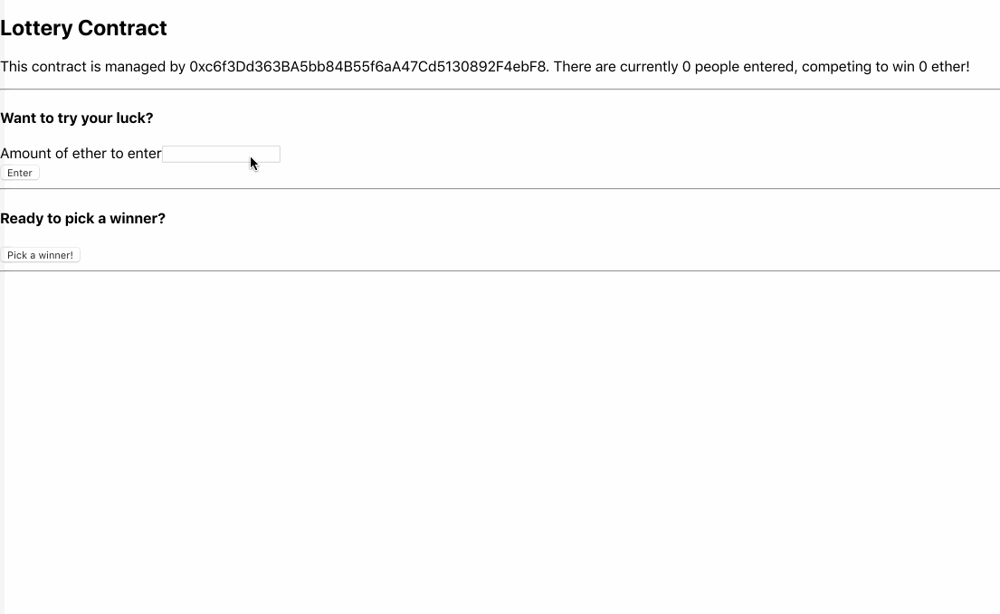
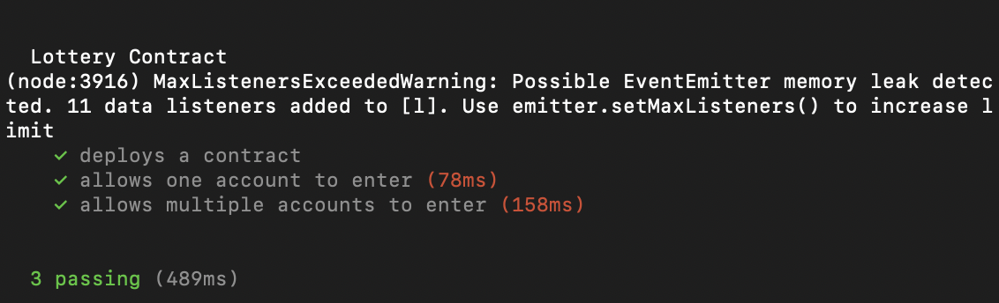
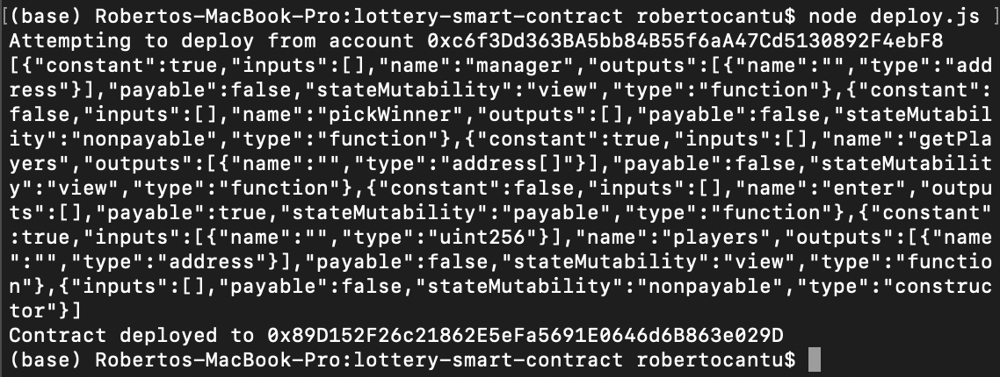

# Decentralized Lottery

This project serves as a lottery built on the rinkeby Ethereum testnet. The contract works by allowing entrants into the lottery, using [MetaMask](https://metamask.io/), would send in testnet ether to the contract.

After some time has passed, the manager address (The same address that created the contract.) would let the contract know to randomly select a winner. The randomness is generated by passing in the current block difficulty, current time, and array of entrant andresses into a SHA256 algorithm.

One a winner is selected via this method, the pot of the testnet ether is automatically disperesed.

Below is a GIF of the contract in action.



## Getting Started

These instructions will get you a copy of the lottery up and running on your local machine for development and testing purposes. See deployment for notes on how to deploy the project on a live system.

### Installing

To begin, first navigate to your desired local directory so you can clone the project repo. Once there, in the terminal, run the following command:

```
git clone https://github.com/RCantu92/decentralized_lottery.git
```
Once you have cloned the project repo, run the following command to install all of the necessary dependencies:
```
npm install
```

The dependencies, along with other tools used, are listed under "Built With."

In addition to this, you will also need to install the [MetaMask](https://metamask.io/) browser extension.

## Running the tests

To run the tests that are already coded, navigate into the lottery-smart-contract/ through the command line. Once there, run the
following the command:

```
npm run test
```
If all the tests are passed, you should an output similar to the following:



*(Note: the warning should not appear and will be looked into further.)

## Deployment

To deploy your own copy of the lottery smart contract onto the Rinkeby Ethereum testnet, navigate back to the lottery-smart-contract directory. Once there, run the following the command:

```
node deploy.js
```

Once deployed, you should see a message similar to the following:



*(Note: the output is comprised of both the contract ABI and the contract address. Also, this is a different deployed address than the listed at the end of this README.)

To now render a local instance of contract on your browser, along with its front end, navigate to the lottery-react/ directory.

Once inside, run the following in the command line:

```
npm run start
```

After running the above command, the React app should launch in your browser. The GIF previously shown demonstrates the process of submitting funds to the lottery and selecting a winner.

Lastly, this contract is deployed on the rinkeby testnet under address [0x40102DAa67EE7c1748F01FB22578d778a0E55f25](https://rinkeby.etherscan.io/address/0x40102daa67ee7c1748f01fb22578d778a0e55f25).

## Built With

* [npm](https://www.npmjs.com/) - Package manager for the JavaScript programming language.
* [Solidity, v.0.4.17](https://solidity.readthedocs.io/en/v0.4.17/) - Smart Contract programming language used.
* [JavaScript](https://developer.mozilla.org/en-US/docs/Web/javascript) - Programming language used.
* [Path](https://nodejs.org/api/path.html) - Module that provides ability for working with file and directory paths.
* [File System](https://nodejs.org/api/fs.html) - Module that provides an API for interacting with the file system.
* [solc](https://github.com/ethereum/solc-js) - Module for compiling the Solidity programming language.
* [Mocha](https://mochajs.org/) - JavaScript test framework.
* [Ganache CLI](https://www.npmjs.com/package/ganache-cli) - The command line version of Ganache, your personal blockchain for Ethereum development.
* [web3](https://github.com/ethereum/web3.js/) - This is the Ethereum JavaScript API which connects to the Generic JSON-RPC spec. Used v.1.0.0-beta.26.
* [Assert](https://nodejs.org/api/assert.html) - Module that provides a set of assertion functions for verifying invariants.
* [Infura](https://infura.io/) - API used to access the Ethereum and IPFS networks.
* [truffle-hdwallet-provider](https://github.com/trufflesuite/truffle-hdwallet-provider) - HD Wallet-enabled Web3 provider. Used to sign transactions for addresses derived from a 12-word mnemonic.
* [React](https://reactjs.org/) - JavaScript library for building user interfaces.
* [Create React App](https://github.com/facebook/create-react-app) - Tool to build React apps.
* [MetaMask](https://metamask.io/) - Browser based wallet used to connect to the Ethereum mainnet as well as testnets.

## Authors

* **Roberto Cantu**  - [GitHub](https://github.com/RCantu92)