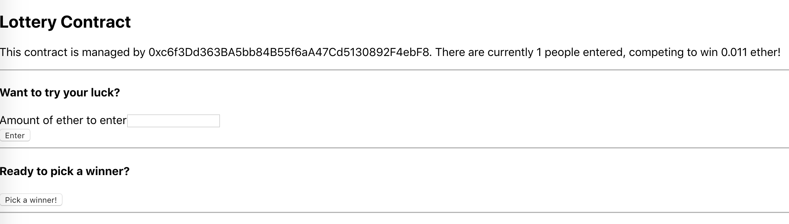

# Decentralized Lottery

This project aims to provide a lottery smart contract that accepts Ether into its pot. The manager would then call the function that would randomly select a winner to whom the pot of Ether would be awarded to.

## Getting Started

The following image demonstrates the process of submitting funds to the contract, through a local react app.

After submitting funds, the page looks like the following.

This is the page refreshed to reflect the change in pot balance.

Once the pot has been awarded, the page looks like the following.

## Deployment

This contract is deployed on the rinkeby testnet under address [0x40102DAa67EE7c1748F01FB22578d778a0E55f25](https://rinkeby.etherscan.io/address/0x40102daa67ee7c1748f01fb22578d778a0e55f25).

## Built With

* [npm](https://www.npmjs.com/) - Package manager for the JavaScript programming language.
* [Solidity, v.4.17.0](https://solidity.readthedocs.io/en/v0.4.17/) - Smart Contract programming language used.
* [JavaScript](https://developer.mozilla.org/en-US/docs/Web/javascript) - Programming language used.
* [Path](https://nodejs.org/api/path.html) - Module that provides ability for working with file and directory paths.
* [File System](https://nodejs.org/api/fs.html) - Module that provides an API for interacting with the file system.
* [solc](https://github.com/ethereum/solc-js) - Module for compiling the Solidity programming language.
* [Mocha](https://mochajs.org/) - JavaScript test framework.
* [Ganache CLI](https://www.npmjs.com/package/ganache-cli) - the command line version of Ganache, your personal blockchain for Ethereum development.
* [web3](https://github.com/ethereum/web3.js/) - This is the Ethereum JavaScript API which connects to the Generic JSON-RPC spec. Used v.1.0.0-beta.35.
* [Assert](https://nodejs.org/api/assert.html) - Module that provides a set of assertion functions for verifying invariants.

* [Infura](https://infura.io/) - API used to access the Ethereum and IPFS networks.
* [truffle-hdwallet-provider](https://github.com/trufflesuite/truffle-hdwallet-provider) - HD Wallet-enabled Web3 provider. Used to sign transactions for addresses derived from a 12-word mnemonic.
* [Create React App](https://github.com/facebook/create-react-app) - Tool to build React apps.

## Authors

* **Roberto Cantu**  - [GitHub](https://github.com/RCantu92)